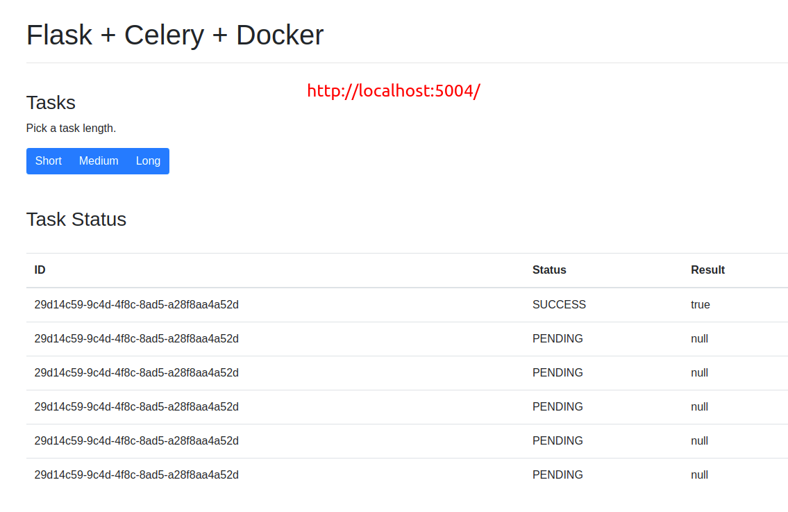
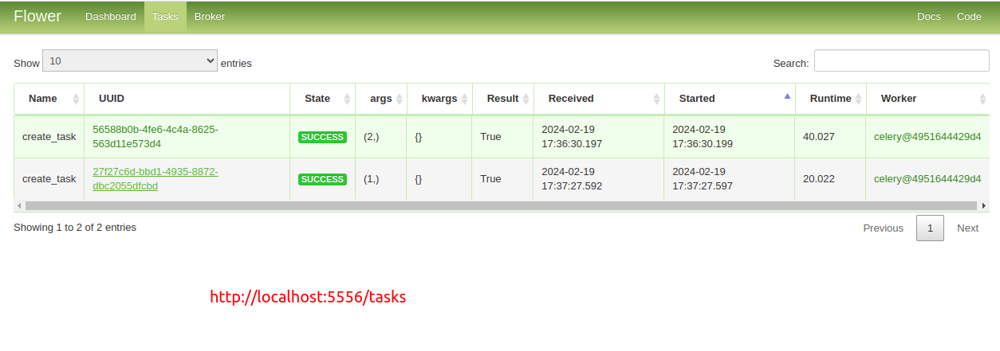

# Asynchronous Tasks with Flask and Celery

Example of how to handle background processes with Flask, Celery, and Docker.

## Want to use this project?

Spin up the containers:

```sh
$ docker-compose up -d --build
```

Open your browser to [http://localhost:5004](http://localhost:5004) to view the app or to [http://localhost:5556](http://localhost:5556) to view the Flower dashboard.

Trigger a new task:

```sh
$ curl http://localhost:5004/tasks -H "Content-Type: application/json" --data '{"type": 0}'
```

Check the status:

```sh
$ curl http://localhost:5004/tasks/<TASK_ID>/
```
---

# Result:
  - ## Show Main panel:
    
  - ## Flower dashboard:
    


# Command Dockers for stop
```sh
  $ docker stop flask-celery_dashboard_1 flask-celery_worker_1 flask-celery_redis_1 web
  $ docker rm -v flask-celery_dashboard_1 flask-celery_worker_1 flask-celery_redis_1 web
```
